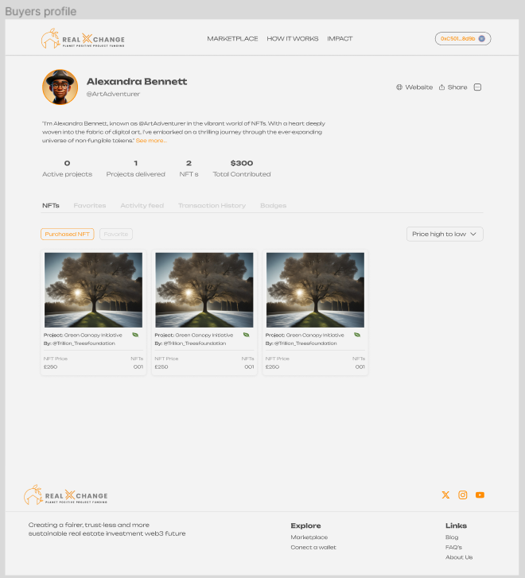

# realXchange User Journey

#### Real exchange user instructions with next.js UI

All users should land on the homepage to start their journey. This page explains the purpose of the dApp and the different project categories available.\\

<figure><figcaption></figcaption></figure>

**1.0 Connecting Wallets**

To interact with the real exchange dApp, the Project Manager and all other user must have already gone through the DID/KYC/KYB/AML (Kilt DID & Deloitte Verifiable Credentials) process (and be whitelisted) in order to be able to call the extrinsics of the Community Project pallet.

\
We have created a number of test accounts with DID’s and verifiable credentials

\
Please go to this page (insert link) to set up the Sporran wallet / DIDs / Credentials prior to proceeding.

\
You will also need to create Talisman or Polkadot.js wallets from the seed phrases.

**2.0 User Accounts**

There are two types of user accounts. If a user has passed KYC, KYB (charity) & AML then they qualify for a Project Manager account.

\
**2.1 Project Manager**

Test Account 1 = Eve Community (Project Manager)... she has already been KYC, KYB (for her charity) & AML checked so her account is active.

\
Once you have setup Eve’s Sporran & Talisman / Polkadot.js wallet then you can connect to her account.

<figure><figcaption></figcaption></figure>

<figure><figcaption></figcaption></figure>

**2.2 NFT Buyer**

Test Account 2 = Charlie Chap - Project NFT Buyer 1... he has already been KYC, KYB & AML checked so his account is active.

\
Once you have setup Charlie’s Sporran & Talisman / Polkadot.js wallet then you can connect to his account.

Test Account 3 = Dave Chum - Project NFT Buyer 2... he has already been KYC, KYB & AML checked so his account is active.

\
Once you have setup Dave’s Sporran & Talisman / Polkadot.js wallet then you can connect to his account.

<figure><figcaption></figcaption></figure>

\
**3.0 Creating & Listing a Project**

Once a user has connected their Sporran wallet and has the relevant credentials as Eve Community - Project Manager (whitelisted KYC/KYB/AML), they can create a new project from the wallet connect button dropdown.

<figure><figcaption></figcaption></figure>

Click on “Create Project” and a new project page will be created.\\

<figure><figcaption></figcaption></figure>

Once all fields have been completed and the continue button clicked. The create project NFT artwork page is displayed.

The duration is the duration of the project in months. The Project Manager (owner) must estimate how long the project will take to complete. Between 1 to 12 months each month will

represent one milestone. For 13 to 24 months then a milestone will be generated for every two months. For 25 to 36 months a milestone is generated every three months.

The price is the target price the project manager needs to complete the desired outcome for the project (supporting documentation needs to be submitted to support these assumptions so NFT buyers can verify the amount). The total price of all NFT types entered must cover the target funds for the project, otherwise the extrinsic will fail.

\
**3.1 Creating Project NFTs**

To raise funds for the project the Project Manager creates up to x4 different variations of NFTs. Each has three different input fields to make the variants unique.

<figure><figcaption></figcaption></figure>

The various NFT types are the variants that the Project Manager wishes to sell on the marketplace. The maximum number of NFT types available for one project is 4, so up to four

different NFT artworks can be created. Each variant can have a bespoke keyword, colour and description.

<figure><figcaption></figcaption></figure>

Once the artwork preview button has been clicked, the artwork is displayed. If this is accepted then the price and the quantity of any type of NFT must be entered. Once the “Create Artwork” button is clicked, then the project is created on the blockchain and listed on the marketplace.

\
**4.0 Listed Project**

Once the project is listed on the real exchange dApp there are two options to support the project.

\
4.1 The first option is to bond tokens to the project by clicking the Bond Token button.

<figure><figcaption></figcaption></figure>

This means that the token is locked for the user and the XCAV tokens in the Community Project Pallet are transferred to the Project Manager after milestones have been reached. XCAV tokens in the Community Project Pallet are allocated by sales of NFTs on the Xcavate real estate dApp NFT marketplace. An amount decided by Governance (initially set to 10%) of these fees go to the Community Project Pallet. A maximum of 10% of the project funding total can be funded by the bonding of XCAV tokens. The parameters required are the collection ID of the project and the amount of XCAV tokens that the user wishes to lock.

\
4.2 The second option is by selling the NFTs.

<figure><figcaption></figcaption></figure>

The NFTs can be purchased by the marketplace users. To do this, the user must connect their wallet.

\\

<figure><figcaption></figcaption></figure>

The number of the NFT type that the user selects for purchase and the number of NFTs of that selected type.

\
Users of the realXchange active projects marketplace can only buy NFTs in a particular project until that project's funding target is reached. They will only be charged for the NFTs when they receive them. The NFTs are paid with XUSD (this represents a test version of a stable coin), and later these funds are forwarded to the Project Manager in equal tranches based on the number of milestones.

\
**5.0 Active Project**

<figure><figcaption></figcaption></figure>

5.1 Once the funding target has been reached, all remaining NFTs that have not yet been sold will be burned.

\
5.2 Once the project has been launched, the first milestone period begins. For testing purposes, it only lasts a few blocks. As soon as the milestone period is over, the first voting period begins. During this period, all users with NFTs in that particular project can vote on the milestone. They can vote either Yes or No on the milestone evidence that has been submitted by the Project Manager.

\\

<figure><figcaption></figcaption></figure>

5.3 NFT holders can vote by clicking the vote button on the particular Community Project they have purchased NFTs in. The voting power is determined by the value of the NFTs that the user has acquired. If the vote has more ‘yes’ votes than ‘no’ votes, the first milestone tranche of funds is sent to the Project Manager's wallet. If it is not reached, the project receives a strike. Once a project receives 3 consecutive strikes, the project is deemed to have defaulted. All remaining project funds are then returned to the NFT owner wallets, the bonding locks are released and the project is deleted. At the end of a milestone the strikes are reset to zero as soon as a vote has taken place.

\\

<figure><figcaption></figcaption></figure>

5.4 As soon as all milestones have been reached, the project is deleted and the bonding locks are released.

\\
